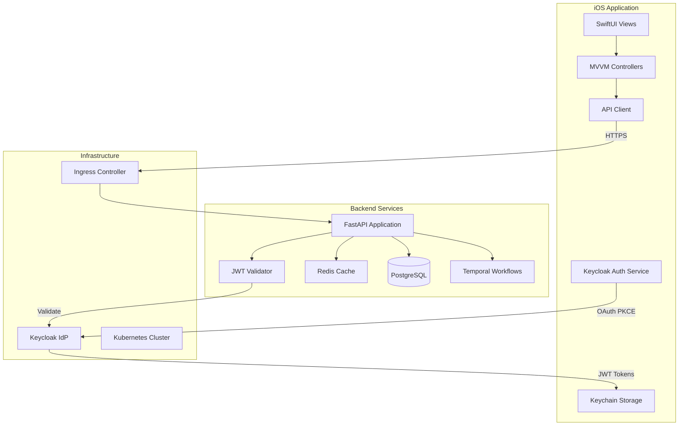
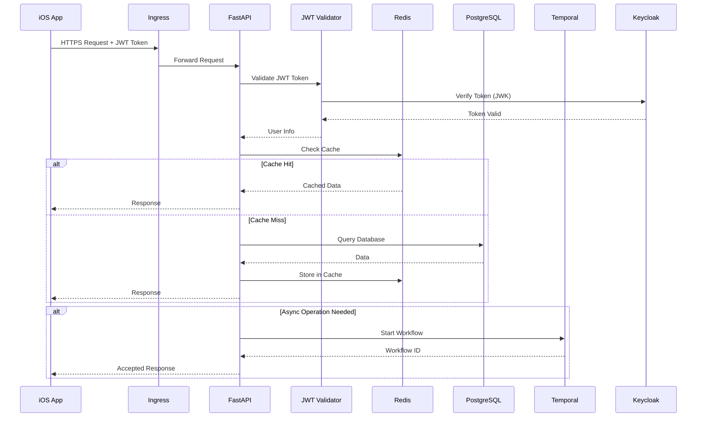
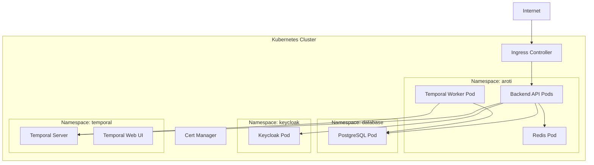
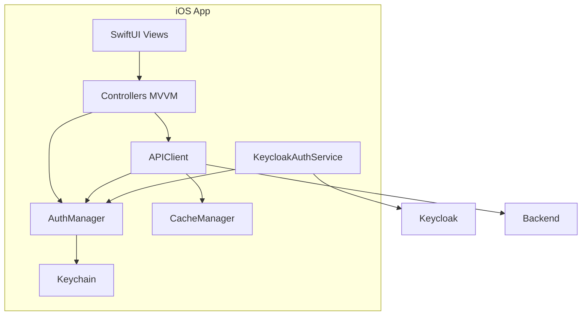
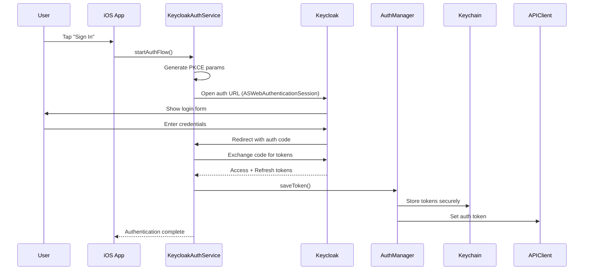
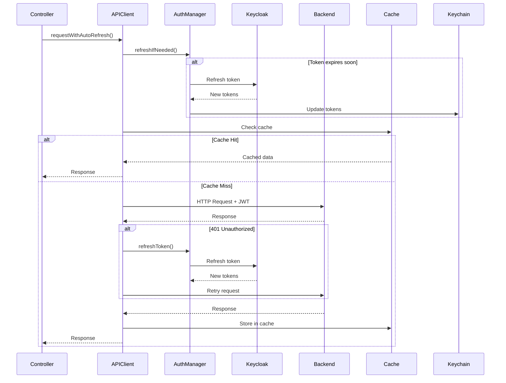
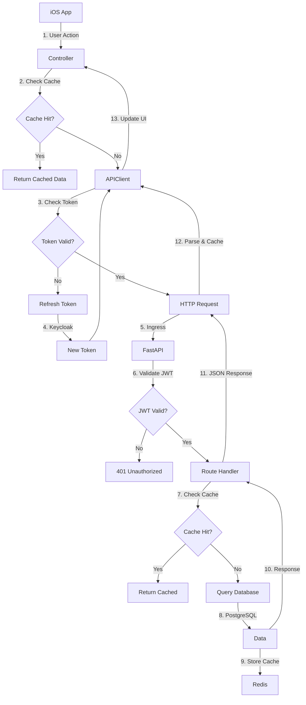
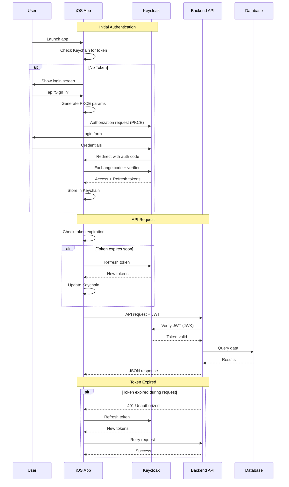
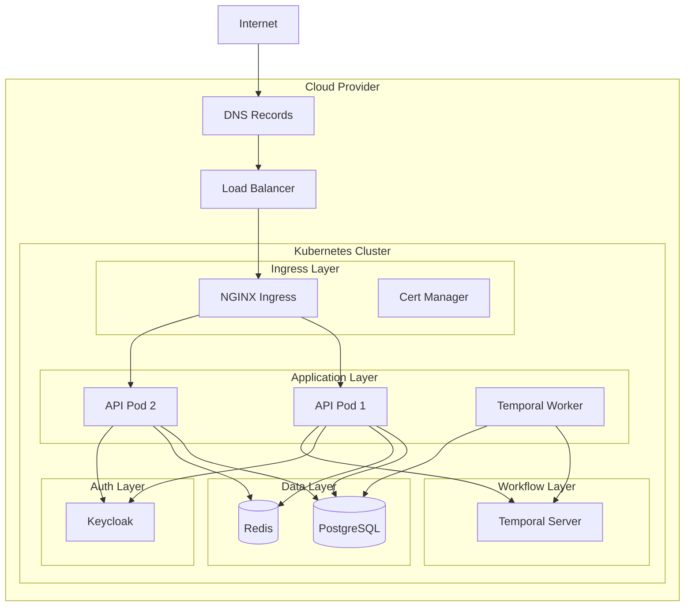

# Aroti Backend Architecture

## Table of Contents

1. [System Overview](#system-overview)
2. [Backend Architecture](#backend-architecture)
3. [Infrastructure Architecture](#infrastructure-architecture)
4. [Frontend Communication](#frontend-communication)
5. [Data Flow](#data-flow)
6. [Authentication Flow](#authentication-flow)
7. [Deployment Architecture](#deployment-architecture)

## System Overview

Aroti is a full-stack application consisting of:

- **iOS Frontend**: SwiftUI application running on iOS devices
- **Backend API**: FastAPI Python application serving REST endpoints
- **Infrastructure**: Kubernetes-based deployment with PostgreSQL, Redis, Keycloak, and Temporal



## Backend Architecture

### Application Structure

The backend follows a layered architecture:

```
app/
├── main.py              # FastAPI application entry point
├── config.py            # Configuration management
├── database.py          # Database connection & session management
├── dependencies.py      # FastAPI dependencies
├── api/                 # Route handlers (presentation layer)
│   ├── specialists.py
│   ├── sessions.py
│   ├── profile.py
│   ├── daily_insights.py
│   └── health.py
├── models/              # SQLAlchemy models (data layer)
│   ├── specialist.py
│   ├── session.py
│   ├── review.py
│   ├── user.py
│   └── profile.py
├── schemas/             # Pydantic schemas (validation layer)
│   ├── booking.py
│   ├── profile.py
│   └── home.py
├── auth/                # Authentication & authorization
│   └── keycloak.py      # JWT validation
├── cache/               # Caching layer
│   └── redis_client.py  # Redis operations
└── workflows/           # Temporal workflows
    ├── session_booking.py
    └── worker.py
```

### Request Processing Flow



### Core Components

#### 1. FastAPI Application (`app/main.py`)

- **Purpose**: Main application entry point
- **Features**:
  - CORS middleware for cross-origin requests
  - Request logging middleware with request IDs
  - Global exception handling
  - Health check endpoints
  - Router registration

**Key Middleware**:
- **CORS**: Allows iOS app to make requests
- **Request Logging**: Logs all requests with timing and request IDs
- **Error Handling**: Catches unhandled exceptions and returns 500 errors

#### 2. Configuration (`app/config.py`)

- **Purpose**: Centralized configuration management
- **Source**: Environment variables (from Kubernetes ConfigMap/Secrets)
- **Settings**:
  - Database connection string
  - Redis host/port/password
  - Keycloak issuer URI and endpoints
  - Temporal connection settings
  - Application environment (dev/prod)

#### 3. Database Layer (`app/database.py`)

- **ORM**: SQLAlchemy 2.0
- **Connection Pooling**: 
  - Pool size: 10 connections
  - Max overflow: 20 connections
  - Connection health checks (pool_pre_ping)
- **Session Management**: Dependency injection for FastAPI routes

#### 4. Authentication (`app/auth/keycloak.py`)

**JWT Validation Process**:

1. Extract token from `Authorization: Bearer <token>` header
2. Fetch JWK (JSON Web Key) set from Keycloak
3. Cache JWK set for 1 hour (reduces Keycloak requests)
4. Verify token signature using RS256 algorithm
5. Validate claims:
   - `iss` (issuer) must match Keycloak realm
   - `aud` (audience) must include backend client ID
   - `exp` (expiration) must be in the future
6. Extract user information from token payload

**Security Features**:
- Token signature verification prevents tampering
- Expiration validation prevents replay attacks
- Audience validation ensures token is for this service
- JWK caching reduces latency and Keycloak load

#### 5. Caching Layer (`app/cache/redis_client.py`)

**Caching Strategy**:

| Resource | TTL | Invalidation |
|----------|-----|--------------|
| Specialist list | 30 minutes | On specialist update |
| Individual specialist | 1 hour | On specialist update |
| User profile | 5 minutes | On profile update |

**Operations**:
- `get_cache(key)`: Retrieve cached value (returns None if miss)
- `set_cache(key, value, ttl)`: Store value with expiration
- `delete_cache(key)`: Invalidate specific key

**Benefits**:
- Reduces database load
- Improves response times
- Distributed caching across API instances

#### 6. API Routes

**Route Structure**:

```
/api/specialists          GET    - List all specialists
/api/specialists/{id}     GET    - Get specialist details
/api/reviews/{id}         GET    - Get reviews for specialist
/api/sessions             GET    - Get user's sessions
/api/sessions             POST   - Book new session
/api/sessions/{id}        GET    - Get session details
/api/sessions/{id}        PUT    - Update session
/api/sessions/{id}        DELETE - Cancel session
/api/user/profile         GET    - Get user profile
/api/user/profile         PUT    - Update profile
/api/user/account         DELETE - Delete account
/api/daily-insights       GET    - Get daily insight
/health                   GET    - Health check
/ready                    GET    - Readiness check
```

**Authentication**: All routes except `/health` and `/ready` require valid JWT token.

#### 7. Temporal Workflows

**Session Booking Workflow**:


**Workflow Benefits**:
- **Reliability**: Automatic retries on failures
- **Durability**: State persisted across restarts
- **Long-running**: Can wait for external events (e.g., 24h reminder)
- **Compensation**: Can rollback on errors

## Infrastructure Architecture

### Kubernetes Deployment



### Service Components

#### 1. Backend API Deployment

**Configuration**:
- **Replicas**: 2 (for high availability)
- **Resources**: 
  - Requests: 500m CPU, 512Mi memory
  - Limits: 1000m CPU, 1024Mi memory
- **Health Checks**:
  - Liveness: `/health` endpoint
  - Readiness: `/ready` endpoint (checks DB + Redis)
  - Startup: `/health` with 12 failure threshold

**Init Container**:
- Runs database migrations before API starts
- Uses same image as API container
- Command: `alembic upgrade head`
- Ensures database schema is up-to-date

**Environment Variables**:
- From ConfigMap: `aroti-backend-config`
- From Secrets: `aroti-backend-secrets`

#### 2. PostgreSQL Database

**Configuration**:
- **Storage**: PersistentVolumeClaim (data survives pod restarts)
- **Database**: Shared by Keycloak, Temporal, and Backend API
- **Schemas**: 
  - `aroti` - Application data
  - `keycloak` - Keycloak data
  - `temporal` - Temporal data

**Connection**:
- Service name: `postgres.database.svc.cluster.local`
- Port: 5432
- Authentication: Username/password from secrets

#### 3. Redis Cache

**Configuration**:
- **Storage**: In-memory (ephemeral)
- **Memory Limit**: 256MB with LRU eviction
- **Persistence**: AOF (Append Only File) enabled
- **Password**: Protected with password authentication

**Connection**:
- Service name: `redis.aroti.svc.cluster.local`
- Port: 6379
- Authentication: Password from secrets

#### 4. Keycloak Identity Provider

**Configuration**:
- **Purpose**: OAuth2/OIDC authentication server
- **Database**: Uses PostgreSQL for persistence
- **Realm**: `aroti`
- **Clients**:
  - `aroti-ios`: Public client with PKCE
  - `aroti-backend`: Confidential client for token validation

**Endpoints**:
- Admin Console: `https://auth.aroti.com/admin`
- Authorization: `https://auth.aroti.com/realms/aroti/protocol/openid-connect/auth`
- Token: `https://auth.aroti.com/realms/aroti/protocol/openid-connect/token`
- JWK Set: `https://auth.aroti.com/realms/aroti/protocol/openid-connect/certs`

#### 5. Temporal Workflow Engine

**Configuration**:
- **Server**: Temporal server cluster
- **Web UI**: `https://temporal.aroti.com`
- **Worker**: Separate deployment running workflow activities
- **Namespace**: `default`

**Connection**:
- Service name: `temporal-frontend.temporal.svc.cluster.local`
- Port: 7233

### Networking

#### Ingress Configuration

**Routes**:
- `api.aroti.com` → Backend API service (port 8888)
- `auth.aroti.com` → Keycloak service (port 8080)
- `temporal.aroti.com` → Temporal Web UI (port 8080)

**TLS**: Managed by cert-manager with Let's Encrypt certificates

#### Service Discovery

Kubernetes DNS provides service discovery:
- `postgres.database.svc.cluster.local`
- `redis.aroti.svc.cluster.local`
- `keycloak.keycloak.svc.cluster.local`
- `temporal-frontend.temporal.svc.cluster.local`

### Data Persistence

**PostgreSQL**:
- PersistentVolumeClaim with storage class
- Data survives pod restarts and deployments
- Regular backups recommended

**Redis**:
- Ephemeral storage (data lost on pod restart)
- Suitable for cache (can be rebuilt from database)
- AOF persistence for durability within pod lifecycle

## Frontend Communication

### iOS App Architecture



### Communication Flow

#### 1. Authentication Flow



**PKCE Flow Details**:

1. **Code Verifier Generation**: Random 32-byte value, base64url encoded
2. **Code Challenge**: SHA256 hash of verifier, base64url encoded
3. **Authorization Request**: Includes `code_challenge` and `code_challenge_method=S256`
4. **Token Exchange**: Includes `code_verifier` to prove ownership

**Security Benefits**:
- Prevents authorization code interception attacks
- Required for public clients (mobile apps)
- No client secret needed

#### 2. API Request Flow



#### 3. Token Refresh Strategy

**Pre-emptive Refresh**:
- Checks token expiration before each request
- Refreshes if token expires in < 5 minutes
- Prevents failed requests due to expired tokens

**Reactive Refresh**:
- On 401 Unauthorized response
- Automatically refreshes token
- Retries original request once
- Transparent to controller layer

**Token Storage**:
- Stored in iOS Keychain (encrypted, secure)
- Persists across app restarts
- Automatically loaded on app launch

### API Client Implementation

**BaseController Pattern**:

```swift
class BaseController: ObservableObject {
    @Published var loadingState: LoadingState = .idle
    @Published var error: APIError?
    
    func requestWithCache<T: Decodable>(
        _ endpoint: APIEndpoint,
        responseType: T.Type
    ) async throws -> T {
        // 1. Check cache first
        if let cached = await getCached(responseType, for: endpoint) {
            return cached
        }
        
        // 2. Make API request with auto-refresh
        let response = try await apiClient.requestWithAutoRefresh(
            endpoint,
            responseType: responseType
        )
        
        // 3. Cache response
        await setCached(response, for: endpoint)
        
        return response
    }
}
```

**Benefits**:
- Automatic caching reduces network requests
- Token refresh handled transparently
- Loading states managed automatically
- Error handling centralized

### Endpoint Definitions

**Type-Safe Endpoints**:

```swift
enum BookingEndpoint: APIEndpoint {
    case getSpecialists
    case getSpecialist(id: String)
    case bookSession(specialistId: String, date: Date, time: String)
    
    var path: String {
        switch self {
        case .getSpecialists:
            return "/api/specialists"
        case .getSpecialist(let id):
            return "/api/specialists/\(id)"
        case .bookSession:
            return "/api/sessions"
        }
    }
    
    var method: HTTPMethod {
        switch self {
        case .getSpecialists, .getSpecialist:
            return .get
        case .bookSession:
            return .post
        }
    }
}
```

**Benefits**:
- Compile-time safety
- No string concatenation errors
- Easy to refactor
- Type-safe request/response models

## Data Flow

### Complete Request Lifecycle



### Caching Strategy

**Two-Tier Caching**:

1. **iOS App Cache** (Memory + Disk):
   - First check: In-memory cache (fastest)
   - Second check: Disk cache (persistent)
   - TTL: 5 minutes default
   - Eviction: LRU when size limits reached

2. **Backend Redis Cache**:
   - Shared across all API instances
   - TTL: 30 minutes (specialists), 1 hour (individual)
   - Invalidation: On data updates

**Cache Key Generation**:
```python
# Backend
cache_key = f"specialist:{specialist_id}"

# iOS
cache_key = "\(endpoint.path)_\(endpoint.method)_\(queryParams)"
```

## Authentication Flow

### Complete OAuth2/OIDC Flow



### Token Lifecycle

**Access Token**:
- Lifetime: 30 minutes
- Purpose: Authenticate API requests
- Storage: iOS Keychain
- Validation: Backend verifies with Keycloak JWK

**Refresh Token**:
- Lifetime: 30 days
- Purpose: Obtain new access tokens
- Storage: iOS Keychain
- Rotation: Enabled (old refresh token invalidated on use)

**Token Refresh Triggers**:
1. **Pre-emptive**: Before request if token expires in < 5 minutes
2. **Reactive**: On 401 Unauthorized response
3. **Background**: Periodic check (optional, not implemented)

## Deployment Architecture

### Production Deployment



### High Availability

**API Layer**:
- Multiple replicas (2+) for redundancy
- Load balanced by Kubernetes service
- Health checks ensure only healthy pods receive traffic

**Database**:
- PostgreSQL with persistent storage
- Regular backups recommended
- Can be scaled to read replicas if needed

**Cache**:
- Redis can be clustered for high availability
- Current setup: Single instance (can be upgraded)

**Keycloak**:
- Can be scaled to multiple instances
- Database-backed for shared state

### Scaling Strategy

**Horizontal Scaling**:
- API pods: Scale based on CPU/memory metrics (HPA configured)
- Worker pods: Scale based on workflow queue depth

**Vertical Scaling**:
- Database: Increase resources if needed
- Redis: Increase memory limit

**Auto-scaling**:
- HPA (Horizontal Pod Autoscaler) configured for API
- Min replicas: 2
- Max replicas: 10
- Metrics: CPU (70%) and Memory (80%)

### Monitoring & Observability

**Health Checks**:
- `/health`: Simple alive check
- `/ready`: Checks database and Redis connectivity

**Logging**:
- Structured logging with request IDs
- Log level configurable (debug/info/warning/error)
- Kubernetes collects logs from all pods

**Metrics** (Future):
- Prometheus for metrics collection
- Grafana for visualization
- Application metrics: request rate, latency, error rate

## Security Architecture

### Network Security

**TLS/HTTPS**:
- All external traffic encrypted with TLS
- Certificates managed by cert-manager (Let's Encrypt)
- Automatic certificate renewal

**Internal Communication**:
- Services communicate via Kubernetes service DNS
- No external exposure except through Ingress
- Network policies can restrict pod-to-pod communication

### Authentication & Authorization

**OAuth2/OIDC**:
- Industry-standard protocol
- PKCE for mobile app security
- Token-based authentication (stateless)

**JWT Validation**:
- Signature verification prevents tampering
- Expiration validation prevents replay
- Audience validation ensures token is for correct service

**Keycloak**:
- Centralized identity management
- Supports multiple authentication methods
- User management and role-based access control

### Data Security

**Encryption at Rest**:
- Database: PostgreSQL encryption (if enabled)
- Keychain: iOS hardware encryption
- Secrets: Kubernetes secrets (base64 encoded, should use external secret management)

**Encryption in Transit**:
- HTTPS for all external communication
- TLS for database connections (if configured)

**Secrets Management**:
- Kubernetes secrets for sensitive data
- Environment variables from ConfigMap for non-sensitive
- Consider external secret management (e.g., Vault) for production

## Development vs Production

### Development Setup

**Local Development**:
- Docker Compose for all services
- Localhost endpoints
- Debug logging enabled
- Relaxed CORS policies

**Configuration**:
```yaml
# docker-compose.yml
services:
  api:
    environment:
      APP_ENV: development
      LOG_LEVEL: debug
      KEYCLOAK_ISSUER_URI: http://localhost:8080/realms/aroti
```

### Production Setup

**Kubernetes Deployment**:
- Managed Kubernetes cluster
- Production-grade networking
- Auto-scaling enabled
- Monitoring and alerting

**Configuration**:
```yaml
# Kubernetes ConfigMap
APP_ENV: production
LOG_LEVEL: info
KEYCLOAK_ISSUER_URI: https://auth.aroti.com/realms/aroti
```

**Differences**:
- HTTPS enforced
- Strict CORS (iOS app bundle ID only)
- Info-level logging (less verbose)
- Resource limits enforced
- Health checks more aggressive

## Troubleshooting Guide

### Common Issues

**1. 401 Unauthorized Errors**
- Check token expiration
- Verify Keycloak is accessible
- Check JWK endpoint is reachable
- Verify client ID matches

**2. Database Connection Errors**
- Verify PostgreSQL pod is running
- Check connection string in secrets
- Verify network policies allow connection

**3. Redis Connection Errors**
- Check Redis pod is running
- Verify password in secrets
- Check network connectivity

**4. Slow API Responses**
- Check cache hit rate
- Monitor database query performance
- Check Redis connectivity
- Review API logs for slow queries

### Debugging Steps

1. **Check Pod Status**:
   ```bash
   kubectl get pods -n aroti
   kubectl logs -n aroti deploy/aroti-backend-api
   ```

2. **Check Service Endpoints**:
   ```bash
   kubectl get svc -n aroti
   kubectl describe svc aroti-backend-api -n aroti
   ```

3. **Test Database Connection**:
   ```bash
   kubectl exec -it -n aroti deploy/aroti-backend-api -- \
     python -c "from app.database import engine; engine.connect()"
   ```

4. **Test Redis Connection**:
   ```bash
   kubectl exec -it -n aroti deploy/aroti-backend-api -- \
     python -c "from app.cache.redis_client import ping; import asyncio; asyncio.run(ping())"
   ```

## Future Enhancements

### Planned Improvements

1. **Service Mesh**: Istio for advanced traffic management
2. **Observability**: Prometheus + Grafana for metrics
3. **Distributed Tracing**: Jaeger for request tracing
4. **API Gateway**: Kong or similar for rate limiting, API versioning
5. **Message Queue**: RabbitMQ or Kafka for async processing
6. **CDN**: CloudFront or similar for static assets
7. **Database Replication**: Read replicas for scaling reads
8. **Redis Cluster**: High availability caching

### Scalability Considerations

**Current Capacity**:
- API: 2-10 pods (auto-scaled)
- Database: Single instance (can be upgraded)
- Cache: Single Redis instance

**Scaling Path**:
1. Increase API replicas (horizontal)
2. Add database read replicas
3. Redis cluster for HA
4. Regional deployment for global users
