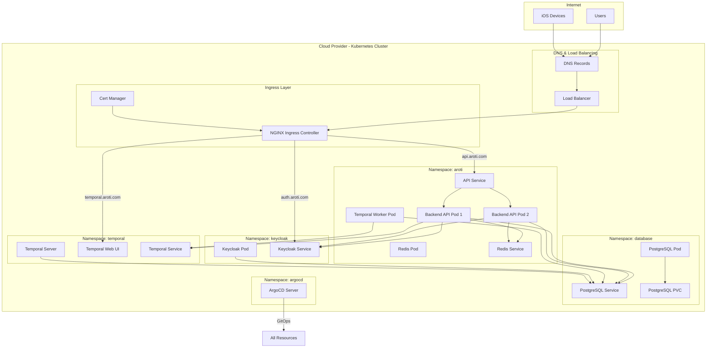

# Aroti Infrastructure Architecture

## Overview

This document describes the complete infrastructure architecture for the Aroti application, including all services, their interactions, and deployment strategy.

## Architecture Diagram



## Component Details

### 1. Ingress & Networking

#### NGINX Ingress Controller

**Purpose**: Routes external traffic to internal services

**Configuration**:
- Routes:
  - `api.aroti.com` → Backend API (port 8888)
  - `auth.aroti.com` → Keycloak (port 8080)
  - `temporal.aroti.com` → Temporal Web UI (port 8080)

**Features**:
- TLS termination
- Load balancing
- Request routing based on hostname

#### Cert Manager

**Purpose**: Automatically manages TLS certificates

**Configuration**:
- Issuer: Let's Encrypt (production)
- Automatic renewal
- Certificate storage: Kubernetes secrets

**Certificates**:
- `api.aroti.com`
- `auth.aroti.com`
- `temporal.aroti.com`

### 2. Backend API

#### Deployment Configuration

**Replicas**: 2 (minimum for HA)

**Resources**:
```yaml
requests:
  cpu: 500m
  memory: 512Mi
limits:
  cpu: 1000m
  memory: 1024Mi
```

**Init Container**:
- Runs before main container
- Executes: `alembic upgrade head`
- Ensures database schema is current

**Health Checks**:
- Liveness: `/health` (every 30s)
- Readiness: `/ready` (every 10s)
- Startup: `/health` (12 attempts, 10s interval)

**Auto-scaling**:
- HPA configured
- Min: 2 replicas
- Max: 10 replicas
- Metrics: CPU (70%), Memory (80%)

#### Service

**Type**: ClusterIP (internal only)

**Port**: 8888

**Selector**: `app: aroti-backend-api`

### 3. PostgreSQL Database

#### Deployment

**Image**: `postgres:15`

**Storage**: PersistentVolumeClaim
- Size: Configurable (default: 20Gi)
- Storage Class: Depends on cluster
- Access Mode: ReadWriteOnce

**Databases**:
- `aroti` - Application data
- `keycloak` - Keycloak data
- `temporal` - Temporal data

**Configuration**:
- Username/password from secrets
- Connection pooling: Managed by SQLAlchemy
- Backup: Recommended (not automated in current setup)

#### Service

**Type**: ClusterIP

**Port**: 5432

**DNS**: `postgres.database.svc.cluster.local`

### 4. Redis Cache

#### Deployment

**Image**: `redis:7-alpine`

**Configuration**:
- Memory limit: 256MB
- Eviction policy: allkeys-lru
- Persistence: AOF (Append Only File)
- Password: From secrets

**Storage**: Ephemeral (in-memory)

#### Service

**Type**: ClusterIP

**Port**: 6379

**DNS**: `redis.aroti.svc.cluster.local`

### 5. Keycloak

#### Deployment

**Image**: `quay.io/keycloak/keycloak:26.0`

**Configuration**:
- Admin credentials from secrets
- Database: PostgreSQL (shared instance)
- Realm: `aroti`
- Clients:
  - `aroti-ios` (public, PKCE)
  - `aroti-backend` (confidential)

**Endpoints**:
- Admin: `https://auth.aroti.com/admin`
- Auth: `https://auth.aroti.com/realms/aroti/protocol/openid-connect/auth`
- Token: `https://auth.aroti.com/realms/aroti/protocol/openid-connect/token`
- JWK: `https://auth.aroti.com/realms/aroti/protocol/openid-connect/certs`

#### Service

**Type**: ClusterIP

**Port**: 8080

**DNS**: `keycloak.keycloak.svc.cluster.local`

### 6. Temporal

#### Temporal Server

**Image**: `temporalio/auto-setup:1.22.4`

**Configuration**:
- Database: PostgreSQL (shared instance)
- Namespace: `default`
- Port: 7233 (gRPC)

#### Temporal Web UI

**Image**: `temporalio/ui:2.21.3`

**Configuration**:
- Connects to Temporal server
- Port: 8080 (HTTP)

#### Temporal Worker

**Deployment**: Separate deployment running workflow activities

**Image**: Same as backend API

**Command**: `python -m app.workflows.worker`

### 7. ArgoCD

#### Purpose

GitOps tool for continuous deployment

**Features**:
- Monitors Git repository
- Automatically syncs Kubernetes resources
- Provides UI for deployment management

**Configuration**:
- Application definitions in each component directory
- Auto-sync enabled
- Self-healing enabled

## Network Architecture

### Service Discovery

Kubernetes provides DNS-based service discovery:

```
<service-name>.<namespace>.svc.cluster.local
```

**Examples**:
- `postgres.database.svc.cluster.local:5432`
- `redis.aroti.svc.cluster.local:6379`
- `keycloak.keycloak.svc.cluster.local:8080`
- `temporal-frontend.temporal.svc.cluster.local:7233`

### Network Policies (Future)

Can be added to restrict pod-to-pod communication:

```yaml
# Example: Only API pods can access database
apiVersion: networking.k8s.io/v1
kind: NetworkPolicy
metadata:
  name: database-access
spec:
  podSelector:
    matchLabels:
      app: postgres
  policyTypes:
  - Ingress
  ingress:
  - from:
    - podSelector:
        matchLabels:
          app: aroti-backend-api
```

## Storage Architecture

### Persistent Volumes

**PostgreSQL**:
- Uses PersistentVolumeClaim
- Data survives pod restarts
- Backup strategy needed

**Redis**:
- Ephemeral (in-memory)
- Data lost on pod restart (acceptable for cache)
- AOF provides durability within pod lifecycle

### Backup Strategy

**Recommended**:
1. Database backups: Daily automated backups
2. Volume snapshots: Periodic snapshots of PVC
3. Configuration backups: Git repository (already versioned)

## Security Architecture

### Secrets Management

**Current**: Kubernetes Secrets (base64 encoded)

**Secrets**:
- `postgres-secret`: Database credentials
- `redis-secret`: Redis password
- `keycloak-secret`: Keycloak admin credentials
- `aroti-backend-secrets`: Backend API secrets

**Future**: External secret management (e.g., HashiCorp Vault)

### Network Security

**TLS/HTTPS**:
- All external traffic encrypted
- Certificates managed by cert-manager
- Automatic renewal

**Internal Communication**:
- Services communicate via ClusterIP (internal only)
- No external exposure except through Ingress

### Access Control

**RBAC** (Role-Based Access Control):
- Service accounts for pods
- Minimal permissions principle
- Separate namespaces for isolation

## Deployment Strategy

### GitOps with ArgoCD

**Workflow**:
1. Developer commits changes to Git
2. ArgoCD detects changes
3. ArgoCD syncs resources to cluster
4. Kubernetes applies changes

**Benefits**:
- Version controlled deployments
- Rollback capability
- Audit trail
- Automated synchronization

### Deployment Order

**Dependencies**:
1. PostgreSQL (required by all)
2. Redis (required by API)
3. Keycloak (required by API)
4. Temporal (optional, for workflows)
5. Backend API (depends on all above)
6. Temporal Worker (depends on Temporal)

**Deployment Script**: `deploy.sh` handles ordering

### Rollback Strategy

**Manual Rollback**:
```bash
kubectl rollout undo deployment/aroti-backend-api -n aroti
```

**ArgoCD Rollback**:
- UI: Click "Rollback" in ArgoCD
- CLI: `argocd app rollback aroti-backend-api`

## Monitoring & Observability

### Health Checks

**Application Level**:
- `/health`: Simple alive check
- `/ready`: Checks dependencies (DB, Redis)

**Kubernetes Level**:
- Liveness probes: Restart unhealthy pods
- Readiness probes: Remove from service endpoints

### Logging

**Current**:
- Pod logs via `kubectl logs`
- Structured logging with request IDs
- Log level configurable

**Future**:
- Centralized logging (e.g., ELK stack)
- Log aggregation
- Log retention policies

### Metrics (Future)

**Planned**:
- Prometheus for metrics collection
- Grafana for visualization
- Custom metrics for business logic

## Scaling Strategy

### Horizontal Scaling

**API Pods**:
- HPA configured
- Scales based on CPU/memory
- Min: 2, Max: 10

**Database**:
- Can add read replicas
- Current: Single instance

**Redis**:
- Can cluster for HA
- Current: Single instance

### Vertical Scaling

**Resources**:
- Increase CPU/memory limits
- Requires pod restart
- Consider node capacity

## Disaster Recovery

### Backup Strategy

**Database**:
- Daily automated backups
- Point-in-time recovery
- Test restore procedures

**Configuration**:
- Git repository (version controlled)
- Kubernetes manifests backed up

### Recovery Procedures

**Database Failure**:
1. Restore from backup
2. Update PVC
3. Restart PostgreSQL pod

**Pod Failure**:
- Kubernetes automatically restarts
- Health checks ensure recovery

**Cluster Failure**:
- Restore from backups
- Redeploy from Git
- Verify all services

## Cost Optimization

### Resource Right-Sizing

**Current**:
- API: 500m-1000m CPU, 512Mi-1024Mi memory
- Database: TBD based on usage
- Redis: 256MB memory limit

**Optimization**:
- Monitor actual usage
- Adjust requests/limits
- Use spot instances for non-critical workloads

### Auto-Scaling

**Benefits**:
- Scale down during low traffic
- Scale up during peak
- Pay only for what you use

## Maintenance

### Updates

**Application Updates**:
- New Docker image tag
- ArgoCD syncs new version
- Rolling update (zero downtime)

**Infrastructure Updates**:
- Update Kubernetes manifests
- ArgoCD applies changes
- Monitor for issues

### Database Migrations

**Process**:
1. Create migration file
2. Test locally
3. Commit to Git
4. ArgoCD syncs
5. Init container runs migration
6. API pods start with new schema

## Troubleshooting

### Common Issues

**1. Pod Not Starting**:
- Check pod logs: `kubectl logs <pod-name>`
- Check events: `kubectl describe pod <pod-name>`
- Verify image exists and is accessible

**2. Service Not Accessible**:
- Check service endpoints: `kubectl get endpoints`
- Verify pod labels match service selector
- Check network policies

**3. Database Connection Issues**:
- Verify PostgreSQL pod is running
- Check connection string in secrets
- Test connection from API pod

**4. Certificate Issues**:
- Check cert-manager logs
- Verify DNS records
- Check Let's Encrypt rate limits

### Debugging Commands

```bash
# Check all pods
kubectl get pods --all-namespaces

# Check services
kubectl get svc --all-namespaces

# Check ingress
kubectl get ingress --all-namespaces

# View pod logs
kubectl logs -n aroti deploy/aroti-backend-api

# Describe resource
kubectl describe pod <pod-name> -n <namespace>

# Exec into pod
kubectl exec -it <pod-name> -n <namespace> -- /bin/sh

# Check events
kubectl get events --all-namespaces --sort-by='.lastTimestamp'
```

## Future Enhancements

### Planned Improvements

1. **Service Mesh** (Istio):
   - Advanced traffic management
   - mTLS between services
   - Circuit breakers

2. **Observability Stack**:
   - Prometheus + Grafana
   - Jaeger for distributed tracing
   - ELK for centralized logging

3. **High Availability**:
   - Multi-zone deployment
   - Database replication
   - Redis cluster

4. **Security**:
   - Network policies
   - Pod security policies
   - External secret management

5. **CI/CD**:
   - Automated testing in pipeline
   - Canary deployments
   - Blue-green deployments
